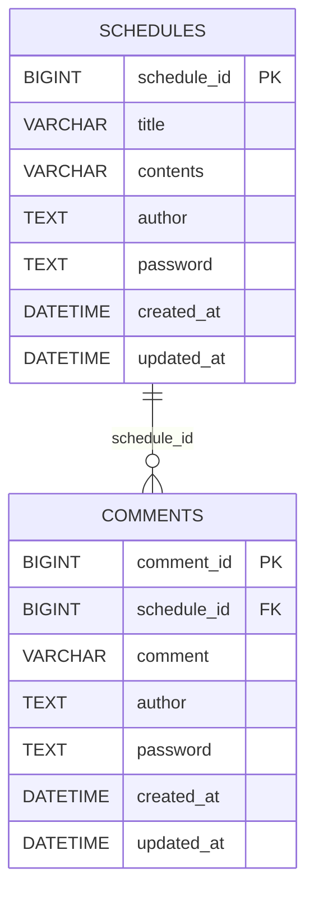

# **ScheduleProject API 명세서**

# ERD 설계

<details>
<summary>ERD</summary>

## Database



</details>

# 일정 CRUD

<details>

<summary>일정 CRUD</summary>

## 일정 생성 API

<details>
<summary>명세서 확인</summary>

## 🔹 기본 정보

- **Method** : `POST`
- **URL** : `/api/schedules`
- **설명** : 새로운 일정을 생성

## 🔹 Request

### Headers

```text
Content-Type: application/json
```

<br>

### Body

```json
{
  "title": "오후 스크럼",
  "contents": "오후 7시 30분에 zep으로 오후 스크럼 진행",
  "author": "김유하",
  "password": "asdf1234"
}
```

| 필드명      | 타입     | 필수 | 설명             |
|----------|--------|----|----------------|
| title    | String | O  | 일정 제목          |
| contents | String | O  | 일정 내용          |
| author   | String | O  | 작성자명           |
| password | String | O  | 비밀번호(수정/삭제 검증) |

<br>

## 🔹 Response

#### ✅ 성공 - 201 Created

```json
{
  "scheduleId": 1,
  "title": "오후 스크럼",
  "contents": "오후 7시 30분에 zep으로 오후 스크럼 진행",
  "author": "김유하",
  "createdAt": "2026-04-18T16:30.96822",
  "updatedAt": "2026-04-18T16:30.96822"
}
```

| 필드명        | 타입            | 필수 | 설명     |
|------------|---------------|----|--------|
| scheduleId | Long          | O  | 고유 식별자 |
| title      | String        | O  | 일정 제목  |
| contents   | String        | O  | 일정 내용  |
| author     | String        | O  | 작성자명   |
| createdAt  | LocalDateTime | O  | 생성한 날짜 |
| updatedAt  | LocalDateTime | O  | 수정한 날짜 |

<br>

#### ❌ 실패 - 400 Bad Request

```text
필수 입력값이 입력되지 않았습니다!
```

</details>

## 일정 전체 조회 API

<details>
<summary>명세서</summary>

## 🔹 기본 정보

- **Method** : `GET`
- **URL** : `/api/schedules`
- **설명** : 전체 일정 조회 / 작성자명이 전달되면 해당 작성자의 일정만 조회

<br>

## 🔹 Query Parameters

| 파라미터명  | 타입     | 필수 | 설명      |
|--------|--------|----|---------|
| author | String | X  | 작성자명 필터 |

### 요청 예시

```http
GET /api/schedules
GET /api/schedules?author=홍길동
```

<br>

## 🔹 Response

#### ✅ 성공 - 200 OK

```json
[
  {
    "scheduleId": 2,
    "title": "오전 스크럼",
    "contents": "오전 10시 5분에 zep으로 오전 스크럼 진행",
    "author": "김유하",
    "createdAt": "2026-04-08T08:40.96822",
    "updatedAt": "2026-04-08T08:40.96822"
  },
  {
    "scheduleId": 1,
    "title": "오후 스크럼",
    "contents": "오후 7시 30분에 zep으로 오후 스크럼 진행",
    "author": "김유하",
    "createdAt": "2026-04-08T08:40.96822",
    "updatedAt": "2026-04-08T16:40.96822"
  }
]
```

| 필드명        | 타입            | 필수 | 설명     |
|------------|---------------|----|--------|
| scheduleId | Long          | O  | 고유 식별자 |
| title      | String        | O  | 일정 제목  |
| contents   | String        | O  | 일정 내용  |
| author     | String        | O  | 작성자명   |
| createdAt  | LocalDateTime | O  | 생성한 날짜 |
| updatedAt  | LocalDateTime | O  | 수정한 날짜 |

#### ❌ 실패 - 500 Internal Server Error

```text
서버 오류가 발생했습니다.
```

</details>

## 일정 단건 조회 API

<details>
<summary>명세서</summary>

## 🔹 기본 정보

- **Method** : `GET`
- **URL** : `/api/schedules/{scheduleId}`
- **설명** : scheduleId로 특정 일정을 조회

<br>

## 🔹 Path Variable

| 변수명        | 타입   | 설명     |
|------------|------|--------|
| scheduleId | Long | 고유 식별자 |

### 요청 예시

```
GET /api/schedules/1
```

<br>

## 🔹 Response

#### ✅ 성공 - 200 OK

```json
{
  "scheduleId": 1,
  "title": "오후 스크럼",
  "contents": "오후 7시 30분에 zep으로 오후 스크럼 진행",
  "author": "김유하",
  "createdAt": "2026-04-18T16:30",
  "updatedAt": "2026-04-18T16:30",
  "comments": [
    {
      "commentId": 1,
      "comment": "정말 좋아보여요~",
      "author": "홍길동",
      "createdAt": "2026-04-10T15:23:15.96822",
      "updatedAt": "2026-04-10T15:23:15.96822"
    },
    {
      "commentId": 2,
      "comment": "짱짱~",
      "author": "김유하",
      "createdAt": "2026-04-10T15:23:15.96822",
      "updatedAt": "2026-04-10T15:23:15.96822"
    }
  ]
}
```

| 필드명        | 타입            | 필수 | 설명     |
|------------|---------------|----|--------|
| scheduleId | Long          | O  | 고유 식별자 |
| title      | String        | O  | 일정 제목  |
| contents   | String        | O  | 일정 내용  |
| author     | String        | O  | 작성자명   |
| createdAt  | LocalDateTime | O  | 생성한 날짜 |
| updatedAt  | LocalDateTime | O  | 수정한 날짜 |

<br>

#### ❌ 실패 - 404 Not Found

```
해당 일정을 찾을 수 없습니다!
```

<br>

</details>

## 일정 수정 API

<details>
<summary>명세서</summary>

## 🔹 기본 정보

- **Method** : `PATCH`
- **URL** : `/api/schedules/{scheduleId}`
- **설명** : 선택한 일정의 제목과 작성자명만 수정 / 수정 시 비밀번호 필요

<br>

## 🔹 Path Variable

| 변수명        | 타입   | 설명     |
|------------|------|--------|
| scheduleId | Long | 고유 식별자 |

### 요청 예시

```
PATCH /api/schedules/1
```

<br>

## 🔹 Request

### Headers

```
Content-Type: application/json
```

### Body

```json
{
  "title": "오후 스크럼",
  "author": "김유하",
  "password": "asdf1234"
}
```

| 필드명      | 타입     | 필수 | 설명    |
|----------|--------|----|-------|
| title    | String | O  | 일정 제목 |
| author   | String | O  | 작성자명  |
| password | String | O  | 비밀번호  |

<br>

## 🔹 Response

#### ✅ 성공 - 200 OK

```json
{
  "scheduleId": 1,
  "title": "오후 스크럼",
  "contents": "오후 7시 30분에 zep으로 오후 스크럼 진행",
  "author": "김유하",
  "createdAt": "2026-04-18T16:30.12345",
  "updatedAt": "2026-04-18T17:30.12345"
}
```

| 필드명        | 타입            | 필수 | 설명     |
|------------|---------------|----|--------|
| scheduleId | Long          | O  | 고유 식별자 |
| title      | String        | O  | 일정 제목  |
| contents   | String        | O  | 일정 내용  |
| author     | String        | O  | 작성자명   |
| createdAt  | LocalDateTime | O  | 생성한 날짜 |
| updatedAt  | LocalDateTime | O  | 수정한 날짜 |

#### ❌ 실패 - 400 Bad Request

```
비밀번호가 일치하지 않습니다!
```

#### ❌ 실패 - 404 Not Found

```
일정을 찾을 수 없습니다!
```

</details>

## 일정 삭제 API

<details>
<summary>명세서</summary>

## 🔹 기본 정보

- **Method** : `DELETE`
- **URL** : `/api/schedules/{scheduleId}`
- **설명** : 선택한 일정을 삭제 / 삭제 시 비밀번호 필요

<br>

### 🔹 Path Variable

| 변수명        | 타입   | 설명     |
|------------|------|--------|
| scheduleId | Long | 고유 식별자 |

### 요청 예시

```
PATCH /api/schedules/1
```

<br>

## 🔹 Request

### Headers

```
Content-Type: application/json
```

### Body

```json
{
  "password": "asdf1234"
}
```

| 필드명      | 타입     | 필수 | 설명   |
|----------|--------|----|------|
| password | String | O  | 비밀번호 |

<br>

## 🔹 Response

#### ✅ 성공 - 204 No Content

#### ❌ 실패 - 400 Bad Request

```
비밀번호가 일치하지 않습니다!
```

#### ❌ 실패 - 404 Not Found

```
해당 일정을 찾을 수 없습니다!
```

</details>

</details>


# 댓글 CRUD

<details>
<summary>댓글 CRUD</summary>

## 댓글 생성 API

<details>
<summary>명세서</summary>

## 🔹 기본 정보

- **Method** : `POST`
- **URL** : `/api/schedules/{scheduleId}/comments`
- **설명** : 새로운 댓글을 등록

<br>

## 🔹 Request

### Headers

```
Content-Type: application/json
```

<br>

### Body

```json
{
  "comments": "우와 너무 재밌어 보여요",
  "author": "김유하",
  "password": "asdf1234"
}
```

| 필드명      | 타입     | 필수 | 설명             |
|----------|--------|----|----------------|
| comment  | String | O  | 댓글 내용          |
| author   | String | O  | 작성자명           |
| password | String | O  | 비밀번호(수정/삭제 검증) |

<br>

## 🔹 Response

#### ✅ 성공 - 201 Created

```json
{
  "commentId": 1,
  "comment": "우와 너무 재밌어 보여요",
  "author": "김유하",
  "createdAt": "2026-04-18T16:30.12345",
  "updatedAt": "2026-04-18T16:30.12345"
}
```

| 필드명       | 타입            | 필수 | 설명     |
|-----------|---------------|----|--------|
| commentId | Long          | O  | 고유 식별자 |
| comment   | String        | O  | 댓글 내용  |
| author    | String        | O  | 작성자명   |
| createdAt | LocalDateTime | O  | 생성한 날짜 |
| updatedAt | LocalDateTime | O  | 수정한 날짜 |

<br>

#### ❌ 실패 - 400 Bad Request

```
필수 입력값이 입력되지 않았습니다!
```

</details>

## 댓글 전체 조회 API

<details>
<summary>명세서</summary>

## 🔹 기본 정보

- **Method** : `GET`
- **URL** : `/api/schedules/{scheduleId}/comments`
- **설명** : 전체 일정 조회

<br>

## 🔹 Response

### Body

#### ✅ 성공 - 200 OK

```json
[
  {
    "commentId": 2,
    "comment": "우와 너무 좋아보여요",
    "author": "김유하",
    "createdAt": "2026-04-08T08:40",
    "updatedAt": "2026-04-08T08:40"
  },
  {
    "commentId": 1,
    "comment": "짱짱",
    "author": "김유하",
    "createdAt": "2026-04-08T08:40",
    "updatedAt": "2026-04-08T16:40"
  }
]
```

| 필드명       | 타입            | 필수 | 설명     |
|-----------|---------------|----|--------|
| commentId | Long          | O  | 고유 식별자 |
| comment   | String        | O  | 일정 내용  |
| author    | String        | O  | 작성자명   |
| createdAt | LocalDateTime | O  | 생성한 날짜 |
| updatedAt | LocalDateTime | O  | 수정한 날짜 |

### ❌ 실패 - 500 Internal Server Error

```
서버 오류가 발생했습니다.
```

</details>

## 댓글 수정 API

<details>
<summary>명세서</summary>

## 🔹 기본 정보

- **Method** : `PATCH`
- **URL** : `/api/schedules/{scheduleId}/comments/{commentsId}`
- **설명** : 선택한 댓글의 제목과 작성자명만 수정 / 수정 시 비밀번호 필요

<br>

## 🔹 Path Variable

| 변수명        | 타입   | 설명        |
|------------|------|-----------|
| scheduleId | Long | 일정 고유 식별자 |
| commentId  | Long | 댓글 고유 식별자 |

### 요청 예시

```
PATCH /api/schedules/1/comments/1
```

<br>

## 🔹 Request

### Headers

```
Content-Type: application/json
```

### Body

```json
{
  "comment": "짱짱굿",
  "author": "김유하",
  "password": "asdf1234"
}
```

| 필드명      | 타입     | 필수 | 설명    |
|----------|--------|----|-------|
| comment  | String | O  | 댓글 내용 |
| author   | String | O  | 작성자명  |
| password | String | O  | 비밀번호  |

<br>

## 🔹 Response

### ✅ 성공 - 200 OK

```json
{
  "commentId": 1,
  "comment": "짱짱굿",
  "author": "김유하",
  "createdAt": "2026-04-18T16:30",
  "updatedAt": "2026-04-18T17:30"
}
```

| 필드명       | 타입            | 필수 | 설명     |
|-----------|---------------|----|--------|
| commentId | Long          | O  | 고유 식별자 |
| comment   | String        | O  | 댓글 내용  |
| author    | String        | O  | 작성자명   |
| createdAt | LocalDateTime | O  | 생성한 날짜 |
| updatedAt | LocalDateTime | O  | 수정한 날짜 |

### ❌ 실패 - 400 Bad Request

```
비밀번호가 일치하지 않습니다!
```

### ❌ 실패 - 404 Not Found

```
일정을 찾을 수 없습니다!
```

</details>

## 댓글 삭제 API

<details>
<summary>명세서</summary>

## 🔹 기본 정보

- **Method** : `DELETE`
- **URL** : `/api/schedules/{scheduleId}/comments/{commentId}`
- **설명** : 선택한 댓글을 삭제 / 삭제 시 비밀번호 필요

<br>

## 🔹 Path Variable

| 변수명        | 타입   | 설명        |
|------------|------|-----------|
| scheduleId | Long | 일정 고유 식별자 |
| commentId  | Long | 댓글 고유 식별자 |

### 요청 예시

```
PATCH /api/schedules/1/comments/1
```

<br>

## 🔹 Request

### Headers

```
Content-Type: application/json
```

### Body

```json
{
  "password": "asdf1234"
}
```

| 필드명      | 타입     | 필수 | 설명   |
|----------|--------|----|------|
| password | String | O  | 비밀번호 |

<br>

## 🔹 Response

### ✅ 성공 - 204 No Content

### ❌ 실패 - 400 Bad Request

```
비밀번호가 일치하지 않습니다.
```

### ❌ 실패 - 404 Not Found

```
해당 일정을 찾을 수 없습니다.
```

</details>

</details>